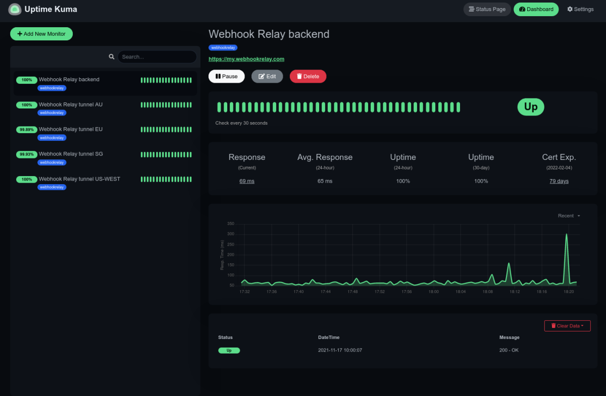

# Deploy personal uptime monitoring

[Uptime-Kuma](https://github.com/louislam/uptime-kuma) is an Open-Source self-hosted uptime monitoring tool. It can periodically check your websites and alert you when services go down.

## Prerequisites

- Account in [Synpse](https://cloud.synpse.net)
- Ensure you have a project and namespace ready (we create them by default once you log-in)

## Deployment

This deployment sample will:
- Create a uptime-kuma container (data will be persisted on the host's `/data/uptime-kuma` path)

## Next steps

Login by opening your http://[device IP]:3001 address. Then, create an account there and start adding your monitors:
